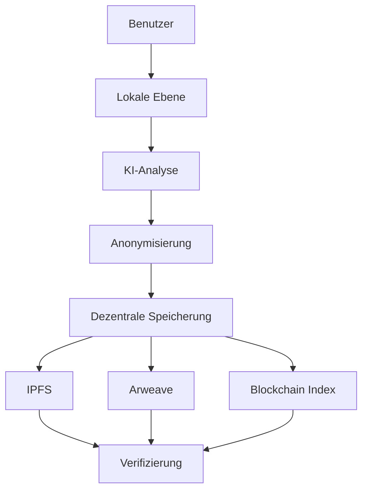

<!-- _class: lead -->

# 🧠 ASI-Core

## Die Revolution der Datensouveränität

**Artificial Self-Intelligence System**

*Professionelles, lebenslanges, dezentrales digitales Gedächtnis*

---

## 📋 Agenda

- **Das Problem**: Warum brauchen wir Datensouveränität?
- **Die Vision**: ASI-Core als Lösung
- **Technische Architektur**: Wie es funktioniert
- **Kernfunktionen**: Was ASI-Core kann
- **Live-Demo**: Praxisbeispiel
- **Roadmap**: Wohin geht die Reise?

---

## 🚨 Das Problem

### Aktuelle Herausforderungen der Datenspeicherung

- **📊 Zentralisierung**: Daten liegen bei wenigen Anbietern
- **🔒 Kontrollverlust**: Keine echte Datensouveränität
- **⏰ Vergänglichkeit**: Daten verschwinden mit dem Service
- **👁️ Überwachung**: Mangelnde Privatsphäre
- **💰 Kostenfallen**: Abhängigkeit von Cloud-Anbietern

---

## 💡 Die Vision

### ASI-Core: Datensouveränität für alle

**"Deine Daten gehören dir - für immer"**

- **🔐 Lokale Verarbeitung**: Sensible Daten bleiben auf dem Gerät
- **🌍 Dezentrale Speicherung**: IPFS + Arweave für Dauerhaftigkeit
- **🧠 KI-gestützt**: Semantische Suche und intelligente Analyse
- **⚡ Offline-fähig**: Funktioniert ohne Internetverbindung
- **🔍 Verifizierbar**: Blockchain-basierte Integritätsprüfung

---

## 🏗️ Technische Architektur

### Hybrid-Modell: Das Beste aus beiden Welten



---

## 🔧 Kernkomponenten

### ASI-Core Bausteine

| Komponente | Zweck | Technologie |
|------------|-------|-------------|
| **Lokale DB** | Persistente Datenspeicherung | SQLite |
| **AI Engine** | Semantische Analyse | Sentence Transformers |
| **Blockchain** | Integritätsverifizierung | Polygon/Mumbai |
| **IPFS** | Dezentrale Dateispeicherung | IPFS HTTP Client |
| **Arweave** | Permanente Archivierung | Arweave SDK |
| **PWA** | Cross-Platform Interface | React + Vite |

---

## 🔐 Datenschutz-First

### K-Anonymität (k≥5)

**Jede gespeicherte Information wird anonymisiert:**

- **PII-Entfernung**: Personenbezogene Daten werden automatisch erkannt und entfernt
- **Aggregierte Speicherung**: Nur statistische Muster bleiben erhalten
- **Lokale Verschlüsselung**: AES-256 für sensible Daten
- **Zero-Knowledge**: Server sehen keine Klartextdaten

---

## 🎬 Live-Demo

### ASI-Core in Aktion

**Szenario: Persönliche Reflexion speichern**

1. **Eingabe**: "Heute war ein produktiver Tag mit klaren Zielen."
2. **Lokale Analyse**: Tags werden automatisch extrahiert
3. **Anonymisierung**: PII wird entfernt, Embeddings generiert
4. **Dezentrale Speicherung**: IPFS CID wird erstellt
5. **Blockchain-Index**: Transaktion wird verifiziert

---

## 📊 Technische Spezifikationen

### Performance & Skalierbarkeit

- **🏃‍♂️ Geschwindigkeit**: <100ms für lokale Analyse
- **💾 Speicher**: <50MB für 10.000 Reflexionen
- **🔄 Offline**: Voll funktionsfähig ohne Internet
- **🌐 Netzwerk**: Minimaler Datenverkehr (<1KB/Reflexion)
- **🔒 Sicherheit**: End-to-End-Verschlüsselung

---

## 🚀 Enterprise-Features

### GitHub Pro+ Integration

- **🔍 Advanced Security**: CodeQL, Dependency Scanning
- **📊 Analytics**: Traffic Insights, Performance Metrics
- **🔄 CI/CD**: Automatische Tests und Deployments
- **🤖 Copilot**: KI-gestützte Entwicklung
- **🐳 Container Registry**: Docker Images auf ghcr.io

---

## 📈 Roadmap 2025

### Q1-Q2: Core Release
- ✅ Hybrid-Architektur implementiert
- ✅ Blockchain-Integration fertig
- ✅ PWA-Interface verfügbar

### Q3-Q4: Enterprise Features
- 🔄 Multi-Device-Synchronisation
- 📱 Mobile App (iOS/Android)
- 🤝 API für Drittanbieter
- 📊 Advanced Analytics Dashboard

---

## 🎯 Use Cases

### Für wen ist ASI-Core gedacht?

- **👥 Privatpersonen**: Lebenslanges digitales Gedächtnis
- **🏢 Unternehmen**: Sichere Wissensdatenbank
- **🔬 Forscher**: Datenschutzkonforme Studien
- **📚 Bildung**: Persönliche Lernfortschritte
- **💼 Beratung**: Kundeninteraktionen dokumentieren

---

## 💰 Wirtschaftlichkeit

### Kosten-Nutzen-Analyse

**Traditionelle Cloud-Lösung:**
- 💸 Hohe monatliche Kosten
- 🔒 Abhängigkeit von Anbietern
- 📊 Daten als Handelsware

**ASI-Core:**
- 💚 Kostenlos und Open Source
- 🔐 Volle Datensouveränität
- 📈 Lebenslange Werterhaltung

---

## 🤝 Beitrag leisten

### Wie Sie mitmachen können

**Entwicklung:**
```bash
git clone https://github.com/swisscomfort/asi-core
cd asi-core && ./setup.sh
python src/asi_core.py
```

**Community:**
- 🐛 Bug Reports auf GitHub
- 💡 Feature Requests
- 📖 Dokumentation verbessern
- 🌍 Übersetzungen

---

## 📞 Kontakt & Support

### Bleiben Sie in Verbindung

- **📧 Email**: info@asi-core.org
- **🐙 GitHub**: https://github.com/swisscomfort/asi-core

---

<!-- _class: lead -->

# 🙏 Vielen Dank!

## Fragen & Antworten

**ASI-Core: Die Zukunft der Datensouveränität**

*Jetzt in Ihren Händen*
