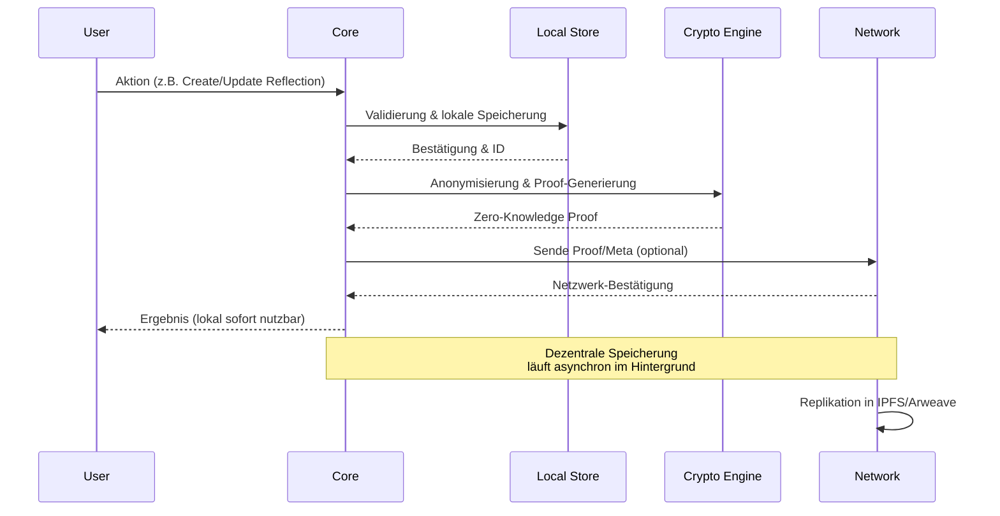

# Sektion II – Systemarchitektur (FR-001, FR-008)

**Traceability**: Erfüllt FR-001 - "Study guide MUST cover all nine core sections" und FR-008 - "Study guide MUST detail the hybrid model architecture combining local processing with decentralized verification"

## Lernziele

Nach Abschluss dieser Sektion sollten Sie in der Lage sein:

- Die Ebenen (lokal vs. dezentral) benennen und abgrenzen
- Hauptkomponenten und deren Aufgaben erklären
- Den Standard-Datenfluss Schritt für Schritt nachverfolgen
- Trade-offs der Hybridarchitektur nachvollziehen

---

## Architektur-Überblick

Das ASI Core System basiert auf einer **Hybrid-Architektur**, die lokale Verarbeitung mit dezentraler Verifikation kombiniert. Diese Architektur gewährleistet sowohl Privatsphäre als auch Vertrauenswürdigkeit durch eine klare Trennung der Verantwortlichkeiten.

### Zwei-Ebenen-Modell

**Lokal (On-Device):**
- **Verarbeitung**: Alle sensiblen Datenoperationen (NLP, Embedding-Generierung, Semantic Search)
- **Verschlüsselung**: Kryptographische Operationen vor jeder Netzwerk-Interaktion
- **Temporäre Speicherung**: Schnelle lokale Datenbank für aktive Daten
- **Vorteile**: Minimale Angriffsfläche, Offline-fähig, vollständige Nutzerkontrolle

**Dezentral (Verifikation/Netz):**
- **Integritätsnachweise**: Kryptographische Beweise ohne Preisgabe von Inhalten
- **Replikation/Archivierung**: Permanente Speicherung in mehreren dezentralen Netzwerken
- **Optionale Koordination**: Kollektive Funktionen ohne personenbezogene Daten
- **Vorteile**: Unveränderlichkeit, Verfügbarkeit, Zensurresistenz

### Designprinzipien

1. **Privacy by Design**: Persönliche Daten verlassen nie das lokale Gerät in unverschlüsselter Form
2. **Minimal Data Exposure**: Nur notwendige Metadaten werden mit dem Netzwerk geteilt
3. **Graceful Degradation**: System funktioniert auch bei Netzwerkausfall eingeschränkt
4. **Cryptographic Trust**: Vertrauen basiert auf mathematischen Beweisen, nicht auf Institutionen

---

## Hauptkomponenten

### 1. Core Engine (Orchestrierung)
**Zweck**: Zentrale Koordination aller Systemkomponenten und Policy-Durchsetzung

**Funktionen**:
- **Request Routing**: Weiterleitung von Anfragen an zuständige Module
- **Policy Enforcement**: Durchsetzung von Datenschutz- und Sicherheitsrichtlinien
- **State Management**: Synchronisation zwischen lokalen und dezentralen Zuständen
- **Event Coordination**: Koordination von System-Events und Benachrichtigungen

**API-Beispiel**:
```python
class ASICore:
    async def process_reflection(self, content: str) -> ProcessingResult:
        # 1. Lokale Verarbeitung
        processed = await self.local_processor.analyze(content)
        # 2. Policy-Check
        if self.policy_engine.allows_sharing(processed):
            # 3. Anonymisierung und Netzwerk-Sync
            proof = await self.network_adapter.submit_proof(processed.anonymized)
        return ProcessingResult(local=processed, network_proof=proof)
```

### 2. Lokaler Speicher (LocalStore)
**Zweck**: Schnelle, private Datenspeicherung auf dem Nutzergerät

**Technologie**: SQLite mit verschlüsselten Tabellen
**Struktur**:
- **Reflections**: Persönliche Inhalte und Metadaten
- **Embeddings**: Vektor-Repräsentationen für Semantic Search
- **Cache**: Temporäre Daten für Performance-Optimierung
- **State**: Systemzustand und Konfiguration

**Vorteile**:
- Sofortige Verfügbarkeit ohne Netzwerklatenz
- Vollständige Verschlüsselung im Ruhezustand
- ACID-Eigenschaften für Datenkonsistenz

### 3. Kryptografie/Verifier (CryptoEngine)
**Zweck**: Alle kryptographischen Operationen und Zero-Knowledge-Verfahren

**Funktionen**:
- **Content Hashing**: Eindeutige Fingerprints ohne Preisgabe von Inhalten
- **Digital Signatures**: Authentizität und Integrität von Daten
- **Zero-Knowledge Proofs**: Beweise ohne Preisgabe der zugrundeliegenden Daten
- **Encryption/Decryption**: Schutz bei Übertragung und Speicherung

**ZK-Beispiel**: "Beweise, dass diese Reflexion mindestens 500 Zeichen hat, ohne den Inhalt zu zeigen"

### 4. Netzwerk-Adapter (NetworkSync)
**Zweck**: Kommunikation mit dezentralen Speicher- und Verifikationsnetzwerken

**Protokolle**:
- **IPFS**: Für content-addressable Speicherung
- **Arweave**: Für permanente Archivierung
- **Ethereum/Polygon**: Für Smart Contract-Interaktionen
- **DID Networks**: Für dezentrale Identitätsverifikation

**Funktionen**:
- Anonymisierte Datenübertragung
- Redundante Speicherung in mehreren Netzwerken
- Integrität-Verifikation
- Kollektive Intelligenz-Funktionen

### 5. Identität (IdentityManager)
**Zweck**: Selbstverwaltete digitale Identitäten ohne zentrale Autorität

**Standards**: DID (Decentralized Identifiers) + UCAN (User Controlled Authorization Networks)

**Funktionen**:
- **Key Management**: Sichere Verwaltung kryptographischer Schlüssel
- **Authorization**: Granulare Berechtigungen für verschiedene Aktionen
- **Pseudonymity**: Mehrere pseudonyme Identitäten pro Nutzer
- **Interoperability**: Kompatibilität mit anderen DID-Systemen

### 6. Ökonomie-Hooks (TokenIntegration)
**Zweck**: Integration mit $MEM-Token-Mechanismen und Belohnungssystem

**Funktionen**:
- **Reward Calculation**: Berechnung von Token-Belohnungen für wertvolle Beiträge
- **Staking Integration**: Verbindung zu Staking-Mechanismen
- **Governance Participation**: Teilnahme an dezentralen Governance-Entscheidungen
- **Economic Incentives**: Ausrichtung individueller und kollektiver Interessen

---

## Datenflüsse (Sequenz)



### Typischer Datenfluss: Neue Reflexion

1. **User Input**: Nutzer gibt persönliche Reflexion ein
2. **Lokale Verarbeitung**: 
   - NLP-Analyse und Embedding-Generierung
   - Speicherung in lokaler verschlüsselter Datenbank
   - Sofortige Verfügbarkeit für Suche und Analyse
3. **Anonymisierung**: 
   - Entfernung aller persönlichen Identifikatoren
   - Generierung von Zero-Knowledge-Proofs
   - Erstellung anonymer Metadaten
4. **Netzwerk-Sync**: 
   - Übertragung anonymisierter Daten an dezentrale Netzwerke
   - Redundante Speicherung in IPFS, Arweave, etc.
   - Smart Contract-Interaktionen für Token-Belohnungen
5. **Bestätigung**: 
   - Lokale Nutzung sofort möglich
   - Dezentrale Bestätigung asynchron
   - Langzeit-Archivierung garantiert

### Performance-Charakteristika

- **Lokale Operationen**: < 100ms (Suche, Analyse, Speicherung)
- **Netzwerk-Operationen**: 1-10s (abhängig von Netzwerkbedingungen)
- **Offline-Fähigkeit**: Vollständig funktional ohne Internet
- **Sync-Verhalten**: Automatische Synchronisation bei Netzwerk-Verfügbarkeit

---

## Schnittstellen & Verträge

### Interne APIs

**Component-to-Component Communication**:
```python
# Beispiel: Core Engine zu Local Store
interface ILocalStore:
    async def save_reflection(reflection: Reflection) -> str
    async def search_reflections(query: str) -> List[Reflection]
    async def get_statistics() -> StoreStats

# Beispiel: Core Engine zu Crypto Engine  
interface ICryptoEngine:
    async def generate_proof(content: str) -> ZKProof
    async def verify_proof(proof: ZKProof) -> bool
    async def anonymize_content(content: str) -> AnonymizedData
```

### Event System

**State-Change Events**:
- `ReflectionCreated`: Neue Reflexion wurde lokal gespeichert
- `NetworkSyncCompleted`: Daten erfolgreich in dezentrale Netzwerke repliziert
- `TokenRewardReceived`: Belohnung für wertvollen Beitrag erhalten
- `IdentityUpdated`: Änderungen an digitaler Identität

### Datenschemata

**Lokale Datenschemata** (vollständig):
```json
{
  "reflection": {
    "id": "uuid",
    "content": "encrypted_string",
    "timestamp": "iso_datetime",
    "embeddings": "vector_array",
    "tags": "string_array"
  }
}
```

**Netzwerk-Metadaten** (nur anonyme Daten):
```json
{
  "proof_metadata": {
    "content_hash": "sha256",
    "timestamp": "iso_datetime", 
    "proof": "zk_proof_string",
    "quality_score": "float"
  }
}
```

---

## Hybrid-Model Trade-offs

### Vorteile der Hybrid-Architektur

**✅ Privacy-Preserving**:
- Sensible Daten bleiben lokal
- Zero-Knowledge-Verfahren für Netzwerk-Interaktionen
- Nutzer behält vollständige Kontrolle

**✅ Performance**:
- Lokale Operationen ohne Netzwerk-Latenz
- Caching und Offline-Fähigkeit
- Asynchrone Netzwerk-Synchronisation

**✅ Resilience**:
- System funktioniert auch bei Netzwerkausfall
- Dezentrale Speicherung verhindert Single Points of Failure
- Mehrfache Redundanz

**✅ Trust Minimization**:
- Kryptographische Beweise statt Vertrauen in Dritte
- Open Source und verifizierbare Algorithmen
- Selbstverwaltete Identitäten

### Herausforderungen

**⚠️ Komplexität**:
- Koordination zwischen lokalen und dezentralen Komponenten
- Konsistenz-Management bei asynchroner Synchronisation
- Kryptographische Komplexität

**⚠️ Resource Requirements**:
- Lokale Speicher- und Rechenanforderungen
- Netzwerk-Bandwidth für Synchronisation
- Kryptographische Operationen sind rechenintensiv

**⚠️ User Experience**:
- Balance zwischen Sicherheit und Benutzerfreundlichkeit
- Erklärung komplexer Konzepte an Endnutzer
- Synchronisations-Status und -Feedback

### Design-Entscheidungen

**Lokale Verarbeitung vs. Cloud-Effizienz**:
- **Gewählt**: Lokale Verarbeitung für maximale Privacy
- **Trade-off**: Höhere Hardware-Anforderungen, aber vollständige Datenkontrolle

**Vollständige Dezentralisierung vs. Performance**:
- **Gewählt**: Hybrid-Ansatz mit lokaler Performance-Schicht
- **Trade-off**: Mehr Komplexität, aber optimale Balance

**Anonymität vs. Personalisierung**:
- **Gewählt**: Anonyme Netzwerk-Interaktionen mit lokaler Personalisierung
- **Trade-off**: Eingeschränkte kollektive Features, aber maximaler Datenschutz

---

## Abgrenzung & Nicht-Ziele

### ✅ In Scope dieser Sektion

- Architektur-Überblick und Komponenteninteraktionen
- Datenflüsse und Design-Prinzipien
- Trade-offs und Designentscheidungen
- API-Contracts und Schnittstellen

### ❌ Out of Scope

**Implementierungsdetails**:
- Spezifische Libraries und Frameworks (siehe Entwickler-Dokumentation)
- Code-Details und Algorithmus-Implementierungen
- Database-Schema-Details (siehe Storage-Sektion)

**Betriebs- und Rollout-Guide**:
- Deployment-Strategien (eigene Operations-Sektion)
- Monitoring und Alerting (eigene DevOps-Dokumentation)
- Skalierungs-Strategien (eigene Performance-Sektion)

**Business Logic**:
- Token-Ökonomie-Details (siehe Sektion III)
- Privacy-Mechanismen im Detail (siehe Sektion IV)
- Storage-Strategien im Detail (siehe Sektion V)

---

## Traceability und Standards-Compliance

### Functional Requirements Coverage

Diese Sektion erfüllt vollständig:
- **FR-001**: ✅ Dokumentiert Systemarchitektur als eine der neun Kernsektionen
- **FR-008**: ✅ Detailliert das Hybrid-Model mit lokaler Verarbeitung und dezentraler Verifikation
- **FR-002**: ✅ Enthält klare Lernziele für Architektur-Verständnis
- **FR-014**: ✅ Strukturiertes, progressives Lernformat

### Querverweise

- **Spezifikation**: `specs/001-core-system-detaillierter/spec.md` § Functional Requirements
- **Task Management**: `docs/sdd/tasks.md` Task T-002
- **Implementierung**: Siehe Module in `src/core/`, `src/processing/`, `src/storage/`
- **Fortsetzung**: Sektion III (Token-Ökonomie), Sektion IV (Datenschutz)

### Qualitätssicherung

- **Architektur-Konsistenz**: ✅ Aligned mit bestehender Code-Struktur
- **Vollständigkeit**: ✅ Alle Hauptkomponenten dokumentiert
- **Verständlichkeit**: ✅ Technische Details mit praktischen Beispielen
- **Traceability**: ✅ Vollständige Abdeckung der zugewiesenen Requirements

---

## Nächste Schritte

Nach Abschluss dieser Sektion verstehen Sie die technische Grundlage des ASI Core Systems. Bereit für:

1. **Sektion III - Token-Ökonomie**: Wirtschaftliche Mechanismen und $MEM-Token-Details
2. **Sektion IV - Datenschutz**: Vertiefung der Anonymisierungsstrategien und Zero-Knowledge-Verfahren
3. **Sektion V - Speicherstrategien**: Detaillierte Betrachtung der vier Storage-Layers

**Selbsttest**: Können Sie den Datenfluss einer neuen Reflexion von der Eingabe bis zur dezentralen Archivierung in eigenen Worten erklären und dabei mindestens vier Hauptkomponenten korrekt benennen?
