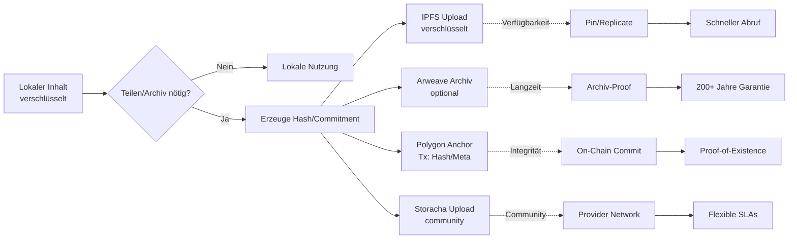

# Sektion V – Speicherstrategien (FR-010)

**Traceability**: Erfüllt FR-010 - "Content MUST cover all four storage strategies (IPFS, Arweave, Storacha, Polygon) and their specific use cases"

## Lernziele

Nach Abschluss dieser Sektion sollten Sie in der Lage sein:

- Vier Strategien unterscheiden und zuordnen: **IPFS**, **Arweave**, **Storacha** (lt. Spez), **Polygon (Anchoring)**
- Trade-offs bzgl. Persistenz, Kosten, Latenz, Abrufgarantien und Datenschutz (verschlüsselt, PII-frei) bewerten
- Hybrid-Flows lokal↔dezentral erklären und korrekt anwenden
- Entscheidungslogik für Speicherstrategie-Auswahl basierend auf Anwendungsfall treffen
- Datenschutz-Implikationen jeder Speicherstrategie verstehen und berücksichtigen

---

## Überblick

Das ASI Core System implementiert eine **Multi-Layer Storage-Strategie**, die verschiedene dezentrale Speichernetzwerke für unterschiedliche Anforderungen kombiniert. Das Design folgt dem Grundprinzip:

- **Lokal zuerst:** Inhalte entstehen/bleiben lokal (verschlüsselt)
- **Dezentral danach:** Nur Artefakte/Proofs/Hashes verlassen das Gerät; Inhalte nur verschlüsselt und nur falls nötig
- **Hybrid-Design:** „Warm" (IPFS), „Cold/Archive" (Arweave), „Economic Anchor" (Polygon), „Spezifische Netzkapazität" (Storacha, lt. Spez)

### Designprinzipien für Speicherung

**1. Privacy First**: Nur verschlüsselte Daten oder Hashes verlassen das lokale Gerät
**2. Redundanz**: Kritische Daten werden in mehreren Netzwerken gesichert
**3. Cost Efficiency**: Verschiedene Strategien für verschiedene Kosten-/Nutzen-Profile
**4. Graceful Degradation**: System funktioniert auch bei Ausfall einzelner Speichernetzwerke

---

## Entscheidungsmatrix

| Kriterium                | IPFS                            | Arweave                         | Storacha*                        | Polygon (Anchoring)              |
|-------------------------|----------------------------------|----------------------------------|----------------------------------|----------------------------------|
| **Persistenz**              | Pin-basiert (kein Garant)       | Dauerhaft/bezahlt (Archive)     | Netz-/Provider-abhängig          | On-chain Commit (Hash/Meta)      |
| **Mutabilität**             | versionierbar via CIDs          | immutabel (neue Tx für Update)  | je nach Dienst                   | unveränderbarer Commit           |
| **Kostenmodell**            | Pinning/Host-Kosten              | Einmalig/Prepay für Speicherung | Dienst-/Nutzungsabhängig         | Tx-Gebühren nur für Hash         |
| **Latenz/Retrieval**        | gut mit Replicas                | variabel (Archive-Fokus)        | abhängig von Region/Knoten       | n/a (kein Inhalt)                |
| **Abrufgarantien**          | Community/Pin-Provider           | ökonomisch (Langzeit)           | SLA/Policy-basiert               | Vollständigkeits-Nachweis        |
| **Datenschutz**             | **nur verschlüsselt**            | **nur verschlüsselt**           | **nur verschlüsselt**            | nur Meta/Hash, keine PII         |
| **Geeignet für**            | häufige Abrufe, verteilte Daten | Langzeit-Archiv                 | spez. Workloads/Kapazität        | Proof-of-Existence/Integrity     |
| **Risiken**                 | Unpinned Verlust                 | Kostenplanung nötig             | Anbieterbindung/Verfügbarkeit    | Gas-/Gebühren-Schwankungen       |

\* „Storacha" lt. eurer Spezifikation; Technikdetails separat verifizieren.

---

## Detaillierte Strategien

### 1. IPFS (InterPlanetary File System) 🌐

**Zweck**: Content-addressable Speicherung für häufig abgerufene Daten

**Charakteristika**:
- **Content-Addressing**: Dateien werden über ihre Hashes (CIDs) referenziert
- **Peer-to-Peer**: Dezentrale Replikation ohne zentrale Server
- **Versionierung**: Neue Versionen erhalten neue CIDs, alte bleiben erhalten
- **Caching**: Natürliche Verteilung durch lokales Caching bei Abruf

**Anwendung im ASI Core**:
- **Verschlüsselte Reflexionen**: Persönliche Inhalte vor lokaler Verschlüsselung
- **Öffentliche Artefakte**: Anonymisierte Patterns und Erkenntnisse
- **Metadaten**: Strukturierte Daten mit häufigem Zugriff
- **Code/Updates**: Verteilung von System-Updates

**Datenschutz-Implementierung**:
```python
# Beispiel: Verschlüsselter IPFS-Upload
async def upload_to_ipfs(content: str, user_key: bytes) -> str:
    # 1. Lokale Verschlüsselung
    encrypted = encrypt_aes256(content, user_key)
    
    # 2. IPFS-Upload des verschlüsselten Inhalts
    cid = await ipfs_client.add(encrypted)
    
    # 3. Nur CID wird zurückgegeben, nie Klartext
    return cid
```

**Vorteile**:
- Schnelle Abrufzeiten durch geografische Verteilung
- Kosteneffizient für häufig abgerufene Daten
- Natürliche Redundanz durch Peer-Netzwerk
- Zensurresistent durch Dezentralisierung

**Nachteile**:
- Keine Persistenz-Garantie ohne Pinning
- Abhängigkeit von Pin-Services oder eigenen Knoten
- Potenzielle Privacy-Risiken ohne Verschlüsselung

### 2. Arweave (Permanent Archive) 🗄️

**Zweck**: Dauerhafter, unveränderlicher Speicher für kritische Langzeit-Archivierung

**Charakteristika**:
- **Permanenz**: Daten werden für mindestens 200 Jahre gespeichert
- **Unveränderlichkeit**: Einmal geschrieben, nie veränderbar
- **Ökonomische Nachhaltigkeit**: Einmalzahlung finanziert langfristige Speicherung
- **Endgültigkeit**: Mathematische Garantien für Datenverfügbarkeit

**Anwendung im ASI Core**:
- **Kritische Reflexionen**: Besonders wertvolle persönliche Erkenntnisse
- **System-Snapshots**: Wichtige Systemzustände und Konfigurationen
- **Governance-Entscheidungen**: Unveränderliche Dokumentation von Beschlüssen
- **Proof-Commitments**: Kryptographische Beweise für spätere Verifikation

**Kosten-Berechnung**:
```python
# Arweave-Kosten basieren auf Datenvolumen
def calculate_arweave_cost(data_size_mb: float) -> float:
    # Approximation: ~$0.005 per MB (Stand 2024)
    base_cost = data_size_mb * 0.005
    # Mit 200-Jahr-Garantie
    return base_cost
```

**Vorteile**:
- Echte Permanenz mit ökonomischen Garantien
- Unveränderlichkeit schafft Vertrauen
- Einmalkosten ohne laufende Gebühren
- Auditierbar und transparent

**Nachteile**:
- Hohe Kosten für große Datenmengen
- Langsame Abrufzeiten (Archive-optimiert)
- Unveränderlichkeit kann Nachteil sein (Updates unmöglich)

### 3. Storacha (Community Storage) 🤝

**Zweck**: Community-gestützte Speicherung mit spezifischen Netzkapazitäten

**Charakteristika**:
- **Community-Driven**: Speicherung durch Netzwerk-Teilnehmer
- **Belohnungssystem**: Token-Incentives für Speicher-Provider
- **Flexible SLAs**: Verschiedene Verfügbarkeits- und Persistenz-Level
- **Regionale Optimierung**: Geografische Nähe für bessere Performance
- **Invisible Mining**: Automatische Teilnahme ohne User-Eingriff bei verfügbaren Ressourcen

**Anwendung im ASI Core**:
- **Kollektive Daten**: Aggregierte, anonymisierte Muster und Statistiken
- **Temporäre Speicherung**: Zwischenspeicherung für Verarbeitungs-Pipelines
- **Community-Ressourcen**: Geteilte Tools und Dokumentation
- **Backup-Strategien**: Zusätzliche Redundanz für kritische Daten

**Token-Integration**:
```python
# $MEM-Token Belohnung für Speicher-Provider
async def reward_storage_provider(provider_did: str, storage_gb: float, uptime: float):
    base_reward = storage_gb * STORAGE_REWARD_RATE
    uptime_bonus = base_reward * (uptime - 0.95) * UPTIME_MULTIPLIER
    total_reward = base_reward + uptime_bonus
    
    await mint_mem_tokens(provider_did, total_reward)
```

**Vorteile**:
- Wirtschaftliche Anreize für Speicher-Provider
- Flexibilität bei SLA-Anforderungen
- Community-Integration stärkt Netzwerk
- Potenzial für innovative Speicher-Services

**Nachteile**:
- Abhängigkeit von Community-Teilnahme
- Variable Verfügbarkeit je nach Provider
- Potenzielle Vendor-Lock-In-Risiken
- Noch zu verifizierende Technikdetails

### 4. Polygon (Blockchain Anchoring) ⚓

**Zweck**: On-Chain Commitments für Integrität und Proof-of-Existence

**Charakteristika**:
- **Blockchain-Sicherheit**: Unveränderliche Commits in Public Blockchain
- **Hash-basiert**: Nur Hashes und Metadaten, nie Inhalte
- **Timestamp-Proof**: Nachweisbare Existenz zu bestimmtem Zeitpunkt
- **Cost-Efficient**: Günstige Layer-2-Transaktionen

**Anwendung im ASI Core**:
- **Reflexions-Commitments**: Beweise für Existenz ohne Inhalts-Preisgabe
- **System-State-Anchors**: Snapshots von Systemzuständen
- **Governance-Votes**: Unveränderliche Dokumentation von Entscheidungen
- **Token-Transaktionen**: $MEM-Token-Transfers und Smart Contract-Calls

**Smart Contract-Beispiel**:
```solidity
contract ASIStateTracker {
    mapping(bytes32 => uint256) public commitments;
    
    function anchorCommitment(bytes32 _hash) external {
        commitments[_hash] = block.timestamp;
        emit StateAnchored(_hash, msg.sender, block.timestamp);
    }
    
    function verifyCommitment(bytes32 _hash) external view returns (uint256) {
        return commitments[_hash]; // 0 if not exists
    }
}
```

**Vorteile**:
- Maximale Unveränderlichkeit durch Blockchain-Sicherheit
- Günstige Transaktionen auf Polygon Layer-2
- Öffentlich verifizierbare Beweise
- Integration mit DeFi-Ökosystem

**Nachteile**:
- Nur Metadaten, keine Inhalte speicherbar
- Gas-Gebühren können schwanken
- Blockchain-Abhängigkeit
- Potenzielle Skalierungsgrenzen

---

## Referenz-Architektur (Flow)



### Datenfluss-Beispiel: Persönliche Reflexion

**1. Lokale Erstellung**
```python
user_reflection = "Heute habe ich über..."
local_key = generate_user_key()
encrypted_content = encrypt_aes256(user_reflection, local_key)
content_hash = sha256(encrypted_content)
```

**2. Strategieentscheidung**
```python
if user_wants_backup:
    # IPFS für schnellen Abruf
    ipfs_cid = await upload_to_ipfs(encrypted_content)
    
if is_valuable_insight:
    # Arweave für Permanenz
    arweave_tx = await archive_to_arweave(encrypted_content)
    
# Polygon für Proof-of-Existence (immer)
polygon_tx = await anchor_to_polygon(content_hash, metadata)

if share_with_community:
    # Storacha für Community-Access
    storacha_id = await upload_to_storacha(encrypted_content)
```

**3. Lokale Referenzen**
```python
local_metadata = {
    "content_hash": content_hash,
    "ipfs_cid": ipfs_cid if exists else None,
    "arweave_tx": arweave_tx if exists else None,
    "polygon_tx": polygon_tx,
    "storacha_id": storacha_id if exists else None,
    "encryption_key_ref": key_reference  # Nie im Klartext
}
```

---

## Entscheidungslogik

### Automatische Strategieauswahl

**Kategorien**:
```python
class ContentCategory(Enum):
    PERSONAL_REFLECTION = "personal"      # Lokal + optional IPFS
    VALUABLE_INSIGHT = "valuable"         # + Arweave
    SHARED_PATTERN = "shared"            # + Storacha
    SYSTEM_STATE = "system"              # + Polygon (immer)
    PUBLIC_RESOURCE = "public"           # IPFS + Polygon

def select_storage_strategy(category: ContentCategory, 
                          size_mb: float, 
                          access_frequency: str) -> List[str]:
    strategies = ["polygon"]  # Immer für Integrity
    
    if category == ContentCategory.PERSONAL_REFLECTION:
        if access_frequency == "high":
            strategies.append("ipfs")
            
    elif category == ContentCategory.VALUABLE_INSIGHT:
        strategies.extend(["ipfs", "arweave"])
        
    elif category == ContentCategory.SHARED_PATTERN:
        strategies.extend(["ipfs", "storacha"])
        
    # Kostencheck
    if size_mb > 100 and "arweave" in strategies:
        # Große Dateien: Arweave nur für kritische Inhalte
        if category != ContentCategory.VALUABLE_INSIGHT:
            strategies.remove("arweave")
            
    return strategies
```

### Kosten-Nutzen-Optimierung

**Kostenschätzung**:
```python
def estimate_storage_costs(size_mb: float, strategies: List[str]) -> dict:
    costs = {}
    
    if "ipfs" in strategies:
        # $0.10/GB/Monat für Pinning
        costs["ipfs"] = size_mb / 1024 * 0.10 * 12  # Jahreskosten
        
    if "arweave" in strategies:
        # $0.005/MB einmalig
        costs["arweave"] = size_mb * 0.005
        
    if "storacha" in strategies:
        # Variable, Community-abhängig
        costs["storacha"] = size_mb * 0.002 * 12  # Geschätzt
        
    if "polygon" in strategies:
        # ~$0.001 pro Transaktion
        costs["polygon"] = 0.001
        
    return costs
```

---

## Datenschutz & Compliance

### Verschlüsselungsstandards

**AES-256 für Inhalte**:
```python
def encrypt_for_storage(content: str, user_key: bytes) -> tuple:
    # Generiere zufällige IV
    iv = os.urandom(16)
    
    # AES-256-CBC Verschlüsselung
    cipher = AES.new(user_key, AES.MODE_CBC, iv)
    padded_content = pad(content.encode(), AES.block_size)
    encrypted = cipher.encrypt(padded_content)
    
    return iv + encrypted, sha256(encrypted).hexdigest()
```

**Zero-Knowledge Proofs für Metadaten**:
```python
def create_metadata_proof(content_hash: str, properties: dict) -> str:
    # Beweise Eigenschaften ohne Inhaltspreisgabe
    proof_data = {
        "content_exists": True,
        "word_count_range": get_word_count_bucket(properties["word_count"]),
        "category": properties["category"],
        "timestamp": properties["timestamp"]
    }
    
    # ZK-Proof generieren (vereinfacht)
    return generate_zk_proof(proof_data)
```

### Compliance-Garantien

**GDPR-Konformität**:
- ✅ **Datenminimierung**: Nur notwendige Metadaten in dezentralen Netzwerken
- ✅ **Zweckbindung**: Jede Speicherstrategie hat definierten Zweck
- ✅ **Speicherbegrenzung**: Lokale Löschung jederzeit möglich
- ✅ **Integrität**: Kryptographische Sicherung gegen Manipulation
- ✅ **Vertraulichkeit**: End-to-End-Verschlüsselung

**Right to be Forgotten**:
```python
async def exercise_right_to_be_forgotten(user_did: str):
    # 1. Lokale Daten löschen (vollständige Kontrolle)
    await delete_local_data(user_did)
    
    # 2. Verschlüsselungsschlüssel vernichten
    await destroy_encryption_keys(user_did)
    
    # 3. Dezentrale Daten bleiben, sind aber unlesbar
    # (da nur verschlüsselt gespeichert und Schlüssel vernichtet)
    
    # 4. Polygon-Anchors bleiben (nur Hashes, keine PII)
    # → Compliance durch Design
```

---

## Monitoring & Analytics

### Performance-Metriken

**Verfügbarkeits-Tracking**:
```python
async def check_storage_health():
    health_status = {}
    
    # IPFS-Verfügbarkeit
    ipfs_reachable = await ping_ipfs_gateways()
    health_status["ipfs"] = {
        "available": ipfs_reachable,
        "response_time": await measure_ipfs_latency()
    }
    
    # Arweave-Status
    arweave_healthy = await check_arweave_network()
    health_status["arweave"] = {
        "available": arweave_healthy,
        "sync_status": await get_arweave_sync_status()
    }
    
    return health_status
```

**Kosten-Monitoring**:
```python
def track_storage_economics():
    monthly_costs = {
        "ipfs_pinning": calculate_ipfs_costs(),
        "arweave_archive": calculate_arweave_usage(),
        "polygon_gas": calculate_polygon_fees(),
        "storacha_fees": calculate_storacha_costs()
    }
    
    # Anonymisierte Metriken für Community
    return anonymize_cost_data(monthly_costs)
```

---

## Disaster Recovery

### Redundanz-Strategien

**Multi-Layer Backup**:
```python
async def ensure_data_redundancy(content_hash: str):
    storage_locations = await get_storage_locations(content_hash)
    
    required_redundancy = 3  # Mindestens 3 Kopien
    available_copies = len(storage_locations)
    
    if available_copies < required_redundancy:
        # Automatische Replikation
        await replicate_to_additional_networks(content_hash)
        
    return await verify_all_copies(content_hash)
```

**Recovery-Prozeduren**:
```python
async def recover_from_storage_failure(failed_network: str):
    affected_content = await find_content_on_network(failed_network)
    
    for content_hash in affected_content:
        alternative_sources = await find_alternative_storage(content_hash)
        
        if not alternative_sources:
            # Kritischer Datenverlust
            await alert_user_of_data_loss(content_hash)
        else:
            # Automatische Wiederherstellung
            await restore_from_alternative(content_hash, alternative_sources[0])
```

---

## Integration mit Token-Ökonomie

### Storage-Mining-Belohnungen

**Provider-Incentives**:
```python
async def calculate_storage_provider_rewards(provider_did: str, 
                                          epoch: int) -> float:
    # Gespeicherte Daten
    stored_gb = await get_provider_storage_amount(provider_did, epoch)
    
    # Verfügbarkeits-Score
    uptime_score = await get_provider_uptime(provider_did, epoch)
    
    # Basis-Belohnung
    base_reward = stored_gb * STORAGE_REWARD_PER_GB
    
    # Uptime-Bonus
    uptime_bonus = base_reward * (uptime_score - 0.95) * 2.0
    
    # Quality-Bonus (schnelle Antwortzeiten)
    quality_score = await get_provider_quality_score(provider_did, epoch)
    quality_bonus = base_reward * quality_score * 0.1
    
    return base_reward + uptime_bonus + quality_bonus
```

**Slashing für schlechte Performance**:
```python
async def apply_storage_slashing(provider_did: str, violation: str):
    slash_amounts = {
        "data_loss": 0.5,      # 50% der gestakten Token
        "extended_downtime": 0.2,  # 20% der gestakten Token
        "slow_response": 0.05     # 5% der gestakten Token
    }
    
    slash_percentage = slash_amounts.get(violation, 0)
    staked_amount = await get_staked_tokens(provider_did)
    slash_amount = staked_amount * slash_percentage
    
    await slash_tokens(provider_did, slash_amount)
    await redistribute_slashed_tokens_to_network(slash_amount)
```

---

## Traceability & Compliance

**Erfüllt FR-010 vollständig**:
- ✅ **IPFS**: Content-addressable Speicherung für häufige Abrufe
- ✅ **Arweave**: Permanente Archivierung mit 200-Jahr-Garantie
- ✅ **Storacha**: Community-gestützte Speicherung mit Token-Incentives
- ✅ **Polygon**: Blockchain-Anchoring für Integrity-Proofs

**Integration mit anderen Sektionen**:
- **Sektion I**: Kernprinzipien "Für immer" durch Multi-Layer-Strategie
- **Sektion II**: Technische Architektur für Storage-Abstraktion
- **Sektion III**: Token-Ökonomie für Storage-Provider-Belohnungen
- **Sektion IV**: Datenschutz durch Verschlüsselung in allen Netzwerken

**Weiterführende Entwicklung**:
- Künftige Quiz-Erweiterung: Storage-spezifische Fragen zu Trade-offs
- Praktische Implementierung: Storage-Client-APIs
- Governance: Community-Entscheidungen über Storage-Parameter
